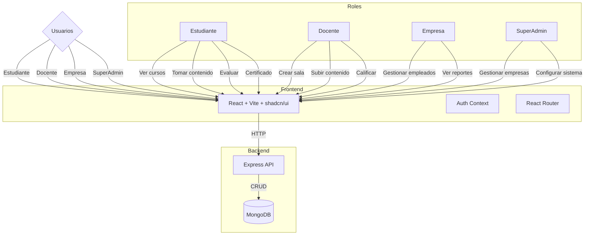
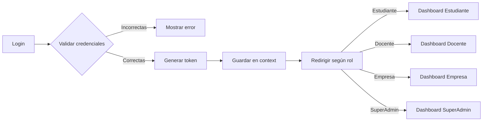
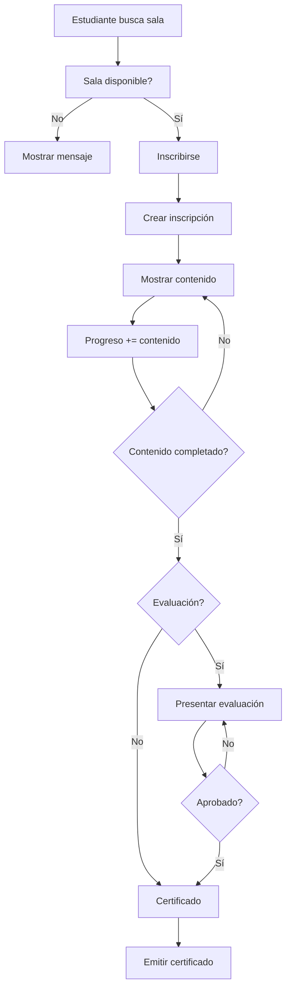

# Diagrama de Flujo - Centro de Formación

## Arquitectura General



## Flujo de Autenticación



## Flujo de Inscripción a Sala



## Modelos de Datos

```mermaid
erDiagram
    USUARIO ||--o| DOCENTE : "es"
    USUARIO ||--o| ESTUDIANTE : "es"
    USUARIO ||--o| EMPRESA : "gestiona"
    
    USUARIO {
        string email PK
        string password
        string rol
        string nombre
        string apellido
        boolean activo
    }
    
    EMPRESA {
        string nombre
        string email
        string estado
    }
    
    SALA {
        string nombre
        string descripcion
        string docenteId FK
        string empresaId FK
        date fechaInicio
        date fechaFin
        string estado
    }
    
    CONTENIDO {
        string salaId FK
        string titulo
        string tipo
        string url
        int orden
    }
    
    INSCRIPCION {
        string estudianteId FK
        string salaId FK
        int progreso
        string estado
    }
    
    EVALUACION {
        string contenidoId FK
        string estudianteId FK
        int nota
        string estado
    }
    
    CERTIFICADO {
        string estudianteId FK
        string salaId FK
        string hash
    }
    
    SALA ||--o{ CONTENIDO : "tiene"
    SALA ||--o{ INSCRIPCION : "tiene"
    CONTENIDO ||--o{ EVALUACION : "tiene"
    INSCRIPCION ||--o| CERTIFICADO : "genera"
